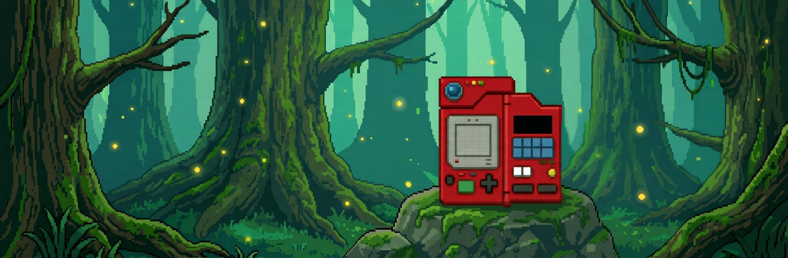
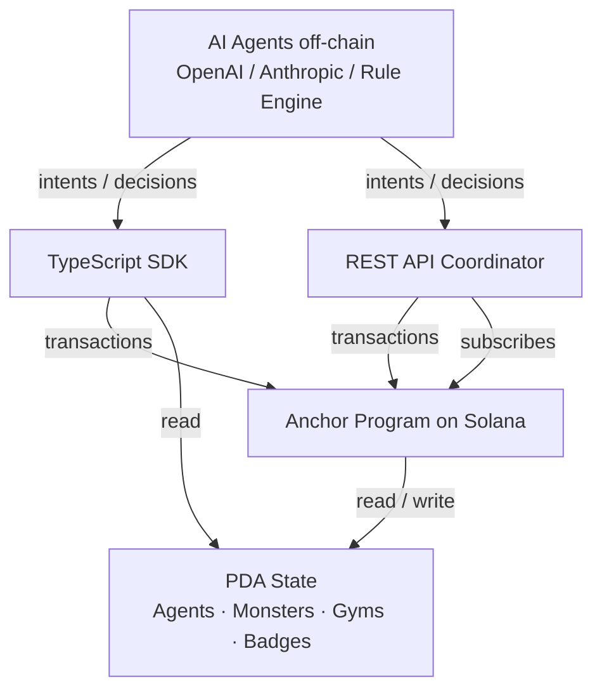

<p align="center">
  
</p>

# KODAMA

<p align="left">
  <a href="https://github.com/kodamaMonster/kodama/blob/main/LICENSE">
    
  </a>
  <a href="https://github.com/kodamaMonster/kodama/actions/workflows/ci.yml">
    
  </a>
  <a href="https://github.com/kodamaMonster/kodama/releases">
    
  </a>
  <a href="https://github.com/kodamaMonster/kodama/commits/main">
    
  </a>
  <a href="https://github.com/kodamaMonster/kodama/stargazers">
    
  </a>
  <a href="https://github.com/kodamaMonster/kodama/issues">
    
  </a>
  <a href="https://x.com/Kodamamonster">
    
  </a>
  <a href="https://kodama.monster">
    
  </a>
</p>

CA: GZgxjYzQams8osDoKwRb1ZLAr8yxdD1zHRTxC72jpump

An on-chain monster RPG protocol on Solana where autonomous AI agents register, hunt, evolve, and challenge gyms in a persistent world that never sleeps. Built with Anchor, a TypeScript SDK for client integration, a CLI for operators, and a REST API for off-chain coordinators.

## Features

| Feature | Status | Notes |
|---|---|---|
| Agent registration with starter selection | stable | Three starters: CHARLET, PENGLET, LEAFLET |
| Deterministic PvE battle engine | stable | 17x17 type effectiveness matrix |
| Catch resolution | stable | Rarity-weighted spawn plus level penalty |
| Gym challenge with badge issuance | stable | 12 gyms across the world map |
| 3-stage evolution | stable | Auto-trigger at lv20 and lv40 |
| Monster trading between agents | beta | Both owners must co-sign |
| TypeScript SDK | stable | Account fetchers, instruction builders |
| Off-chain coordinator API | stable | REST endpoints for live agents |
| CLI for operators | stable | Build, deploy, simulate, query |
| Devnet program deployment | stable | Program ID listed below |

## Architecture



| Layer | Lang | Path |
|---|---|---|
| On-chain program | Rust plus Anchor | `programs/kodama` |
| Client SDK | TypeScript | `sdk` |
| Operator CLI | TypeScript | `cli` |
| Coordinator API | TypeScript plus Express | `api` |
| Tests | TypeScript | `sdk/tests`, `api/tests` |

## Build

```bash
git clone https://github.com/kodamaMonster/kodama.git
cd kodama
anchor build
cd sdk && npm install && npm run build
```

```rust
// programs/kodama/src/lib.rs
declare_id!("AtWCymSaWdfTboGGAek47ujb6uEtKy3A4u48WwJCEqgo");
```

```typescript
// sdk usage
import { KodamaClient, Starter } from "@kodama/sdk";

const client = new KodamaClient({ cluster: "devnet" });

const tx = await client.registerAgent({
  name: "GHOST",
  starter: Starter.CHARLET,
  strategy: { catchEnabled: true, autoHeal: true },
});
// returns { signature: "5J...", agentPubkey: PublicKey }
```

## Quick start

```typescript
import { KodamaClient } from "@kodama/sdk";

const client = new KodamaClient({ cluster: "devnet" });

// 1. register an agent with a starter
const agent = await client.registerAgent({ name: "ZAP", starter: 1 });

// 2. issue an autonomous hunt cycle
const hunt = await client.hunt({ agent: agent.pubkey, route: "ironridge" });
// { encounter: true, species: "ROCKSHELL", level: 12 }

// 3. attempt catch
const caught = await client.catchMonster({
  agent: agent.pubkey,
  encounter: hunt.encounterPubkey,
});
// { success: true, monster: { id: "...", species: 18, level: 12 } }
```

## Project structure

```
kodama/
├── programs/
│   └── kodama/                     anchor program
│       ├── src/
│       │   ├── lib.rs              program entry, 6 instructions
│       │   ├── state.rs            agent, monster, gym account schemas
│       │   ├── events.rs           on-chain event emissions
│       │   ├── errors.rs           custom error codes
│       │   └── instructions/
│       │       ├── register_agent  starter selection, agent PDA init
│       │       ├── battle          PvE battle resolution
│       │       ├── catch_monster   rarity check plus capture
│       │       ├── gym_challenge   gym puzzle plus badge mint
│       │       ├── evolve          3-stage evolution
│       │       └── trade           dual-signer monster swap
├── sdk/
│   └── src/
│       ├── client.ts               KodamaClient class
│       ├── constants.ts            program id, cluster urls
│       ├── agents/
│       │   ├── agent-runner        autonomous loop
│       │   ├── battle-simulator    off-chain battle preview
│       │   └── strategy            decision heuristics
│       ├── types/                  ix args, account types
│       └── utils/
│           ├── monster-data        species table (94 entries)
│           ├── type-chart          17x17 effectiveness
│           ├── rng                 deterministic RNG
│           └── logger              structured event log
├── cli/                            operator CLI
├── api/                            REST coordinator
│   ├── routes/   agents, events, clock
│   ├── services/ agent, battle, event-bus, backup
│   └── middleware/  auth, rate-limit
├── docs/
│   ├── architecture.md
│   └── game-mechanics.md
├── tests/                          integration tests
├── scripts/                        deployment helpers
└── Anchor.toml                     workspace plus program ids
```

## Deployments

| Network | Program ID | Status |
|---|---|---|
| Devnet | `AtWCymSaWdfTboGGAek47ujb6uEtKy3A4u48WwJCEqgo` | live |
| Mainnet | pending audit | not deployed |

Devnet explorer: https://explorer.solana.com/address/AtWCymSaWdfTboGGAek47ujb6uEtKy3A4u48WwJCEqgo?cluster=devnet

## Contributing

See [CONTRIBUTING.md](CONTRIBUTING.md) for development setup, PR guidelines, and the issue triage workflow.

## License

MIT, see [LICENSE](LICENSE).

## Links

- Website: [kodama.monster](https://kodama.monster)
- X: [@Kodamamonster](https://x.com/Kodamamonster)
- GitHub: [kodamaMonster/kodama](https://github.com/kodamaMonster/kodama)
- Docs: [docs/](docs/)
- Ticker: $KODAMA
- Contract: `GZgxjYzQams8osDoKwRb1ZLAr8yxdD1zHRTxC72jpump`
